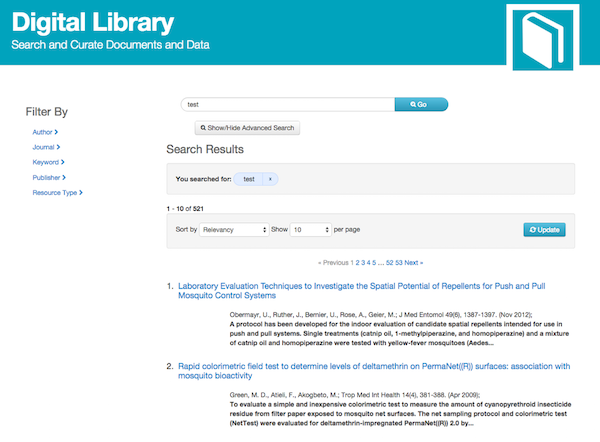
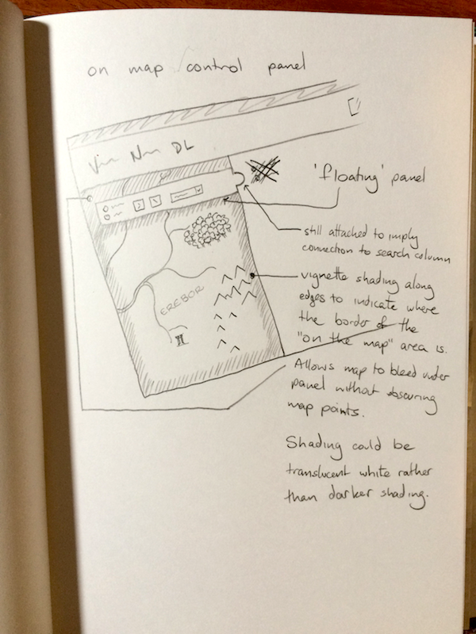
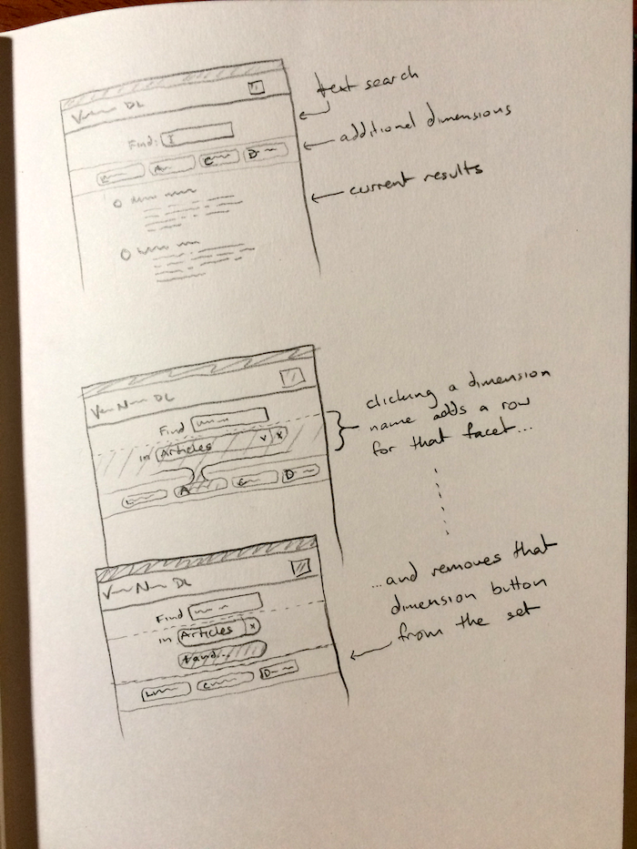
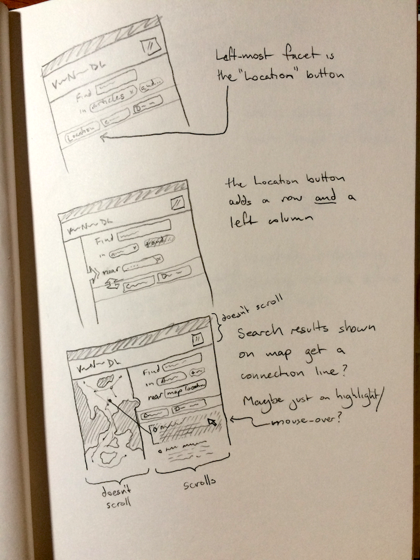
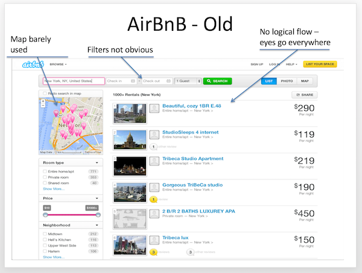
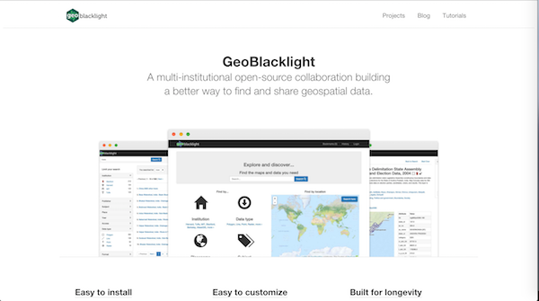
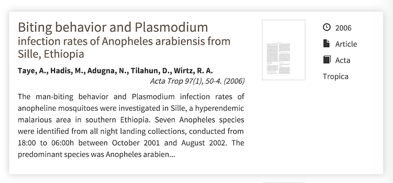

# VecNET Digital Library redesign and geospatial search using GeoBlacklight

Adding geospatial search to the VecNET digital library using GeoBlacklight.

<!-- more -->


We got on the GeoBlacklight bus when we joined the VecNET project.  VecNET was a Gates Foundation initiative to simulate malaria vectors, transmission and interventions using parameters from current literature.  To provide the latest and greatest parameters, VecNET used a curated digital library with a web based search interface.

---
# What was the problem?

The search interface wasn't spatial, had some usability issues, and needed some design love.

  - Spatial searching was limited to certain named locations; there was no map to visually define a search region, and we all love maps.
  - Entries in the search results didn't show enough information, so users had to keep checking their search filters to understand what they were looking at.  AirBnB called this 'pogosticking'.
  - Filters that could help to narrow down a search were present only in a side column, and underused.




---
# Drawing board
With broad changes in mind, rough designs were pencilled up and debated around the office whiteboard.  Hopefully the designer in you enjoys these as much as we did.

##### Map and fancy notch thing

The notch made it into the final design, the floating panel and vignette shading didn't.


##### Simple facet design

We decided early to move the facet selection into a single column with the results.



##### UI with map and facets

The single search/results column let us plan a nice clean map display.



---
# Look at that
After the early work of original thought, we checked out related works. It turns out the original VecNET search bore a striking resemblance to the old AirBnB search!  AirBnB had recently done a redesign to fix what they have concluded were large design and usability issues.




We could learn from their experience and benefit from work done by a talented team.
Our final proposal was iteratively formed with feedback from VecNET librarians based around simple UX principles:

 - Big searchable map
    - A well designed map can clearly display information about where papers were from; users can easily find data from a specific location
 - Intuitive top to bottom page flow
    - Natural progression means less 'pogosticking'
 - Simple search filters
    - Use ordinary words instead of obscure terms


---

# Enter GeoBlacklight
The stack at VecNET was inherited from a prototype Ruby on Rails app with an old Solr and Fedora backend.  For a spatial search we would need to integrate spatial values of records with the existing dataset.  On the front end we wanted to use Leaflet and GeoJSON and uses Rail's API ability to serve data to a modern Javascript powered frontend with the UI goodness that users enjoy.

Just as the Backbone.js structure was being laid down, we noticed a new project with strong ideas about user friendly geospatial discovery.



The GeoBlacklight project was being developed in the open and was based on the [Blacklight project](http://projectblacklight.org/) which was a basis of the legacy app.  In addition backwards compatibility was emphasised which is a high virtue when choosing an upstream.
Normally you don't get excited about Rails apps at version 0.4 but with institutions like Stanford, MIT and Princeton contributing to an active development community that was encouraging new users – it was as close as software gets to alluring.


# Customising GeoBlacklight
Adding VecNET-specific functionality to the existing GeoBlacklight platform can with a bit of a learning curve but thankfully was well documented with an [active Google groups community](https://groups.google.com/forum/#!forum/geoblacklight-working-group).
Our VecNET specific additions included:

  - displaying several locations associated with a single 'record' on a map
  - search by map area and bounding box
  - point clustering for when density was too high

Other customisations to fit our design idea included:

  - Unified search page with AJAX search form and results
  - Shiny rounded CSS3 corners (because [Steve Jobs amiright](http://www.folklore.org/StoryView.py?story=Round_Rects_Are_Everywhere.txt)...)
  - Friendly animation and transitions between results and map marker
  - Enhanced metadata on the results page for better selection
  - [Progressive enhancement](https://en.wikipedia.org/wiki/Progressive_enhancement) with fallback to rendered HTML for SEO.

We implemented the changes with vanilla Javascript and Rails templates to minimise the learning curve for future maintenance.


# Enhancing metadata with Micro Standards

Geoblacklight uses an geospatial schema extended from prior standards, [documented here](https://github.com/geoblacklight/geoblacklight-schema), and [explained best here](http://journal.code4lib.org/articles/9710)(imho).  It encodes the metadata and geospatial characteristics of the stored records.  The Ruby on Rails server in GeoBlacklight will embed the data into rendered HTML with a [schema.org](http://schema.org/) style which looks the 'div' element in the HTML below:

```
	<div class="document " itemscope="" itemtype="http://schema.org/Dataset">
	<div class="documentHeader row" data-layer-id="urn:arrowsmith.mit.edu:MIT.000932529" data-bbox="-83.5 41.5 -79.0 43.0">
```

The value, `data-bbox`, for instance, will be be used by [Leaflet.js](http://leafletjs.com/) to manipulate the map or generate a marker.  It is a simplified explanation but you get the idea.

We want to make searching easy and efficient by displaying the most relevant data. Using the mechanism above, we can extend our digital library to show users important details such as journal, date, author.  The image below is an example of those micro schema values turned into nice UI elements for users.




# Part II?

There was plenty more fun in customising GeoBlacklight but that is all for now.  
If you have any feedback, we would love to hear from you. We promise to take criticism well :) Promise.
