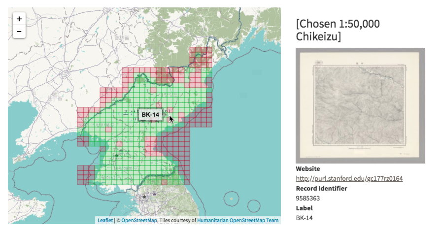

# GeoBlacklight Winter Code 2018 & New Release 1.8

The GeoBlacklight Community Winter Code has resulted in a new release (1.8.0) that includes a new feature for index maps, bug fixes, and improved metadata documentation.

<!-- more -->

Developers from Stanford, Princeton, NYU, Cornell, and the University of Minnesota participated in a two-week [GeoBlacklight Winter Code during January 2018](https://github.com/geoblacklight/geoblacklight/projects/1).  The developers completed work on enabling a new format for index maps, squashing several bugs, and an expansion to the [GeoBlacklight Metadata 1.0 schema documentation](https://github.com/geoblacklight/geoblacklight/blob/master/schema/geoblacklight-schema.md). Progress was also made on the display of attribute table information and the development of a GeoBlacklight plugin that would enable harvesting thumbnail images from geospatial web services or IIIF image servers.

### OpenIndexMaps
[GeoBlacklight’s latest release](https://github.com/geoblacklight/geoblacklight/releases/tag/v1.8.0) includes a major new feature that enables [OpenIndexMaps](https://openindexmaps.github.io/) based on the GeoJSON format. This feature will display a spatial index in the map preview box that allows users to select an overlay object, such as a grid section. This will bring up a preview of the item’s basic metadata, a thumbnail image, and access links. See [Configuring Index Maps for Use in GeoBlacklight](https://geoblacklight.org/guides.html#configuring-index-maps-for-use-in-geoblacklight) for more information on how to add index maps to metadata records.

#### [Check out this index map in EarthWorks from Stanford Libraries:](https://earthworks.stanford.edu/catalog/stanford-ts545zc6250)

