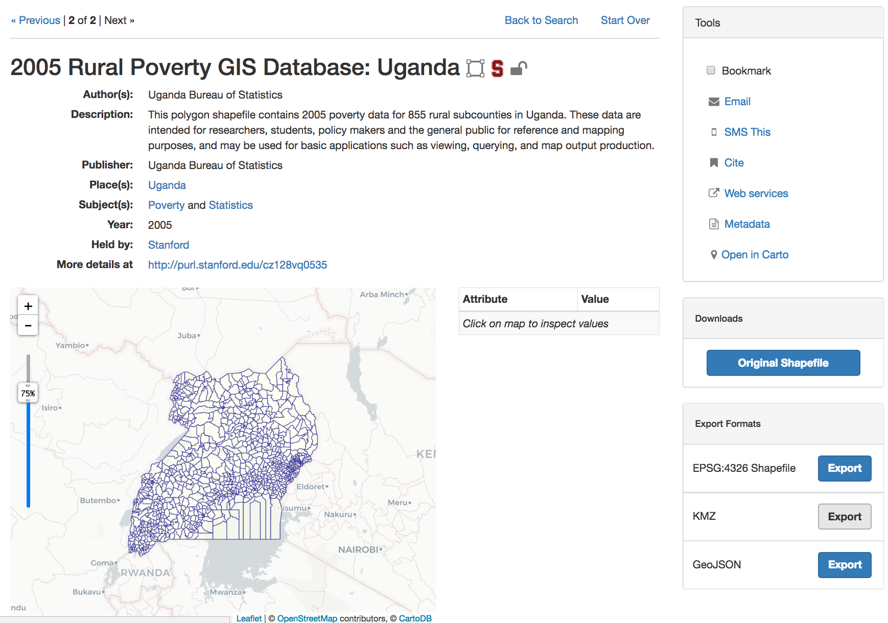

# 2018 Summer Code for GeoBlacklight

The GeoBlacklight Community Summer 2018 Code has resulted in a new release (1.9.0) that includes compatibility with Blacklight 7 and numerous other upgrades.

<!-- more -->

### overview

From July 23 - August 3, 2018, developers from Stanford, Princeton, NYU, Cornell, and the University of Minnesota participated in a [GeoBlacklight Summer Code ](https://github.com/geoblacklight/geoblacklight/projects/2) that resulted in the release of [GeoBlacklight 1.9.0](https://github.com/geoblacklight/geoblacklight/releases/tag/v1.9.0). Overall, the was a highly efficient, concentrated burst of activity that led to many upgrades in the code and a variety of improvements to our development workflow. The team also reviewed all recent and backlogged GitHub issues and was able to address over 50 of them during the course of the.

Here's a summary of some upgrades and changes:

* BLACKLIGHT 7 UPGRADE: The majority of the activities involved ensuring compatibility with Blacklight (the underlying architecture for GeoBlacklight) and its upcoming [Blacklight 7](https://github.com/projectblacklight/blacklight/releases/tag/v7.0.0.rc1) release. This included removing anticipated deprecations and incorporating Bootstrap 4.0 principles, such as a stylistic switch from pixels to rems.

* DOWNLOAD PANEL: The work to stay current with Bootstrap resulted a redesign of the Download tool to display a link to a direct download of the original dataset in one panel, with generated exports from a geospatial web server available underneath. This new Export Formats panel also features more semantically accurate text with the inclusion of the coordinate reference system (EPSG:4326) for generated exports. Here is a screenshot of the new layout:

* METADATA BUGS: A few long standing bugs or omissions involving metadata interactions were addressed. The latest release allows certain characters, such as colons, in the record slugs, and handles empty values for the Geometry Type field. A new key was also added for the `dct_references` element to display native HTML records in the metadata viewer.

* INTERNATIONALIZATION: There is now better support for internationalization on view page elements - We fixed many lingering elements that had been hard-coded into English and turned them into translatable elements, which ultimately makes GeoBlacklight more accessible for use in other languages.

* TESTING WORKFLOWS: The GeoBlacklight GitHub repository was migrated to CircleCI instead of Travis CI for continuous integration and the metadata fixture records used for testing numerous functions were cleaned up and supplemented with new examples.

* LEAFLET MAP: Leaflet was upgraded to version 1.0, which required a few updates to the code. (Note - users looking to upgrade to the latest release of GeoBlacklight should check the release notes for potential issues with Leaflet 1.0 compatibilities.) The Leaflet map preview also includes new default basemaps - Now, users can toggle between seven default, open-source basemaps to use within the application.

### Moving forward

The work on the summer has left us in a good place to cut a major 2.0 release of GeoBlacklight that will rely on upgraded frameworks. Thanks to everyone who participated with code development and review - Consider joining us for the next!
