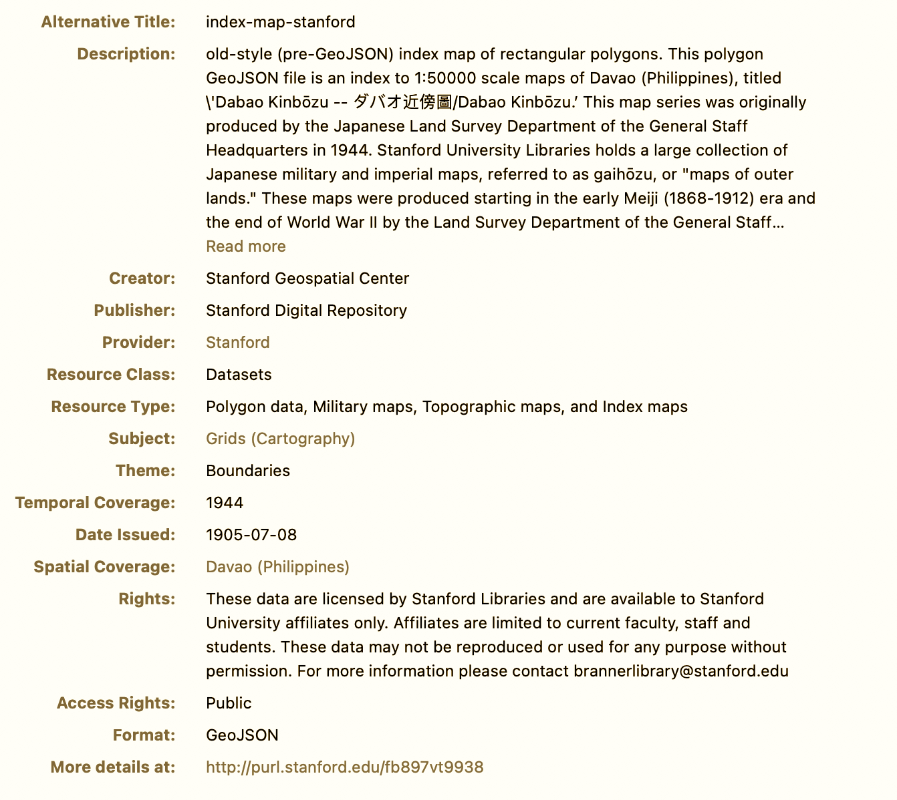
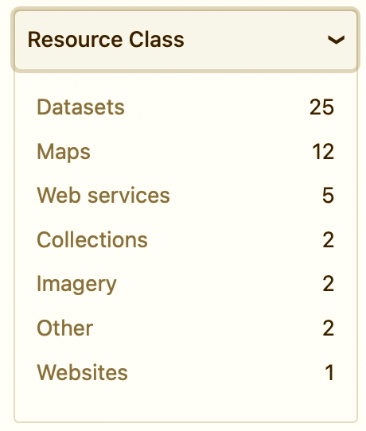
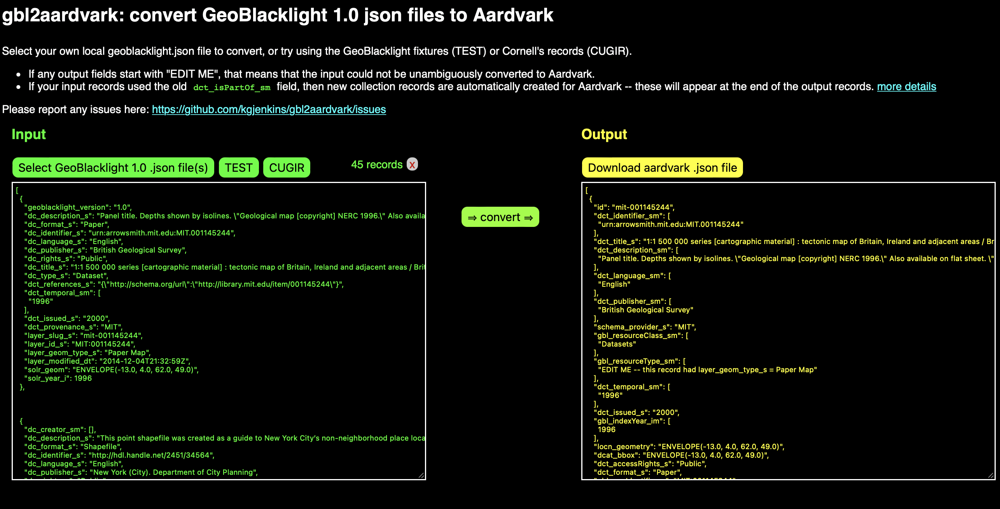

# The wait is over - GeoBlacklight 4.0 is here!

The GeoBlacklight Community is excited to announce the release of our next major version:  [GeoBlacklight 4.0](https://github.com/geoblacklight/geoblacklight/releases/tag/v4.0.0). This version features official support for OGM Aardvark, and we have enriched the documentation for GeoBlacklight and OpenGeoMetadata.

<!-- more -->

!!! info "KEY LINKS"

	* > **[The RubyGems GeoBlacklight v4.0.0 Release](https://rubygems.org/gems/geoblacklight/versions/4.0.0) ([GitHub](https://github.com/geoblacklight/geoblacklight/releases/tag/v4.0.0))**
	* > **[Guide for Upgrading to GeoBlacklight Version 4](https://geoblacklight.org/docs/upgrading/Upgrading_to_version_4_0/)**
	* > **[Guide for Upgrading Metadata to the OpenGeoMetadata (OGM) Aardvark Schema](https://opengeometadata.org/upgrade-metadata/)**
	* > **[gbl2aardvark](https://kgjenkins.github.io/gbl2aardvark/)**: A new web-hosted application to automatically convert GeoBlacklight 1.0 JSON files to the OGM Aardvark schema

## 1. Official support for the latest OpenGeoMetadata schema, **OGM Aardvark**.

[OGM Aardvark](https://opengeometadata.org/ogm-aardvark/) is a geospatial metadata schema that was collaboratively developed by [geospatial metadata specialists and librarians from twelve university libraries](https://opengeometadata.org/about-ogm-aardvark/#credits). Launched in 2021, it replaces the GeoBlacklight metadata schema version 1.0 (GBL 1.0). Compared to GBL 1.0, OGM Aardvark features syntactical updates to improve interoperability and incorporates additional fields for better descriptions of a wider range of resources. It is now the recommended schema for all institutions adopting GeoBlacklight.

By default, GeoBlacklight 4.0 displays all human-readable OGM Aardvark metadata values on the item view page, including the new fields for:

* specifying rights and licenses *(see figure 1)*
* categorizing records by class and type *(see figure 2)*
* interactive widgets connecting records via seven different types of relationships

---------

**Figure 1**

*Image caption: Sample record item view page displaying new OGM Aardvark metadata fields and values*

> Note: Learn how to customize your item view pages with the Application Configuration section of the new [Guide for Upgrading to GeoBlacklight Version 4](https://geoblacklight.org/docs/upgrading/Upgrading_to_version_4_0/)

---------

**Figure 2**

*Image caption: The new Resource Class facet*

> Note: Read more about the Resource Class field on its [schema documentation page](https://opengeometadata.org/ogm-aardvark#resource-class)

------------

## 2. Documentation improvements

We focused our Summmer Community Sprint 2022 on improving the technical documentation for GeoBlacklight and OpenGeometadata.

### 2.1 GeoBlacklight documentation

Check out our new application documentation site at [https://geoblacklight.org/docs](https://geoblacklight.org/docs/). Notable additions include:

* a [detailed guide for upgrading to version 4.0](https://geoblacklight.org/docs/upgrading/Upgrading_to_version_4_0/)
* an updated and vetted [Quickstart Guide](https://geoblacklight.org/docs/installation/geoblacklight_quick_start/) and [Developer's Guide](https://geoblacklight.org/docs/installation/getting_started_developers/) for installing GeoBlacklight locally
* a new section called [Running in Production](https://geoblacklight.org/docs/production/hardware_recommendations/), which includes example environments and maintenance recommendations
* new guides for adding customizations to Leaflet: [Homepage Map Centroid Clusters](https://geoblacklight.org/docs/customization/homepage_map_centroid_clusters/) and [Dynamic Basemap Switching](https://geoblacklight.org/docs/customization/dynamic_basemap_switching/)

### 2.3 OpenGeoMetadata documentation

Visit our improved metadata documentation site at [https://opengeometadata.org](https://opengeometadata.org). Recent additions include:

* easier navigation for finding OGM Aardvark schema elements, including a grouped chart and an alphabetical list
* metadata crosswalk tables
	* [OGM Aardvark - GBL 1.0 crosswalk table](https://opengeometadata.org/aardvark-gbl-1-crosswalk/)
	* [OGM Aardvark - FGDC - ISO 19139 crosswalk table](https://opengeometadata.org/aardvark-fgdc-iso-crosswalk/)

* new conversion tools
	* [a draft XSLT](https://github.com/OpenGeoMetadata/GeoCombine/pull/131)
 for converting FGDC metadata to OGM Aardvark
	*  [gbl2aardvark](https://kgjenkins.github.io/gbl2aardvark/): a new web hosted tool to automatically convert GeoBlacklight 1.0 JSON files to OGM Aardvark

**Figure 3**

*Image caption: screenshot of [gbl2aardvark](https://kgjenkins.github.io/gbl2aardvark/)*

-------------

## 3. Credits

This release represents substantial and concerted efforts from many in our community: over the past one to two years, [fourteen community members](https://github.com/geoblacklight/geoblacklight/releases/tag/v4.0.0) committed code to our GitHub repository for this release, while nearly [twenty individuals](https://opengeometadata.org/about-ogm-aardvark/#credits) contributed to creating our related project, the OGM Aardvark metadata schema.

**Thank you to everyone for participating in this evolution!**
