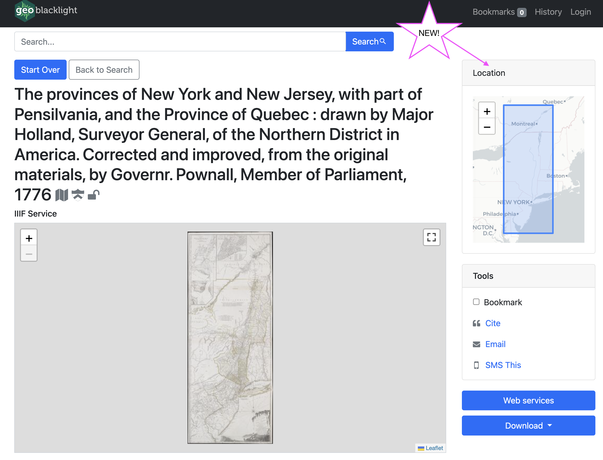

# GeoBlacklight v4.1 released along with new documentation pages

## Summary

The GeoBlacklight Community held a community sprint in June 2023 and produced a [new minor release of GeoBlacklight](https://github.com/geoblacklight/geoblacklight/releases/tag/v4.1.0), new & improved documentation pages, and a platform upgrade of the GeoBlacklight website.

<!-- more -->

## New GeoBlacklight Features

### Display Note field

[Version 4.1](https://github.com/geoblacklight/geoblacklight/releases/tag/v4.1.0) supports the latest [OpenGeoMetadata Aardvark field, Display Note](https://opengeometadata.org/ogm-aardvark/#display-note). This field presents a prominent shaded box with a message to the user that can be coded by color and icon. The messages can be labeled as `Danger` (red), `Info` (blue), `Tip` (green), `Warning` (yellow), or nonspecific (grey).

<figure markdown>

  <figcaption>Display note examples</figcaption>
</figure>

### Location inset for scanned map images

We added a location inset map that appears on the item view page for scanned maps hosted with IIIF. This shows users a bounding box of the area represented on the scanned map.

<figure markdown>

  <figcaption>Location map with IIIF image</figcaption>
</figure>

### Additional built-in icons

As new institutions join the GeoBlacklight community, we add their institutional logo to our icon library for interoperable display alongside their metadata records. New icons added to this release include:

* University of Arizona
* American Geographical Society Library - UWM Libraries
* University of Nebraska
* Rutgers University

<figure markdown>

  <figcaption>Screenshot preview of the GeoBlacklight icon library</figcaption>
</figure>

### Improved item relations widget

Version 4.0 (September 2022) introduced item relations widgets to capture a variety of relationships as set out by the OpenGeoMetadata Aardvark schema.  The latest release improves the display in several ways:

* All widget labels now match their metadata field names
* For parent pages, the widget will now include a truncated list of child items along with a list to browse all child items; [fixed issue #1290](https://github.com/geoblacklight/geoblacklight/issues/1290)
* For items using `Replaces` and `Replaced By`, GeoBlacklight will only query the `Replaces` field, but will display relationship widgets for each item; [addressed issue #1264](https://github.com/geoblacklight/geoblacklight/issues/1264)

!!! info

	[To read more about version 4.1 and how to upgrade, read the release notes on GitHub.](https://github.com/geoblacklight/geoblacklight/releases/tag/v4.1.0)
	
## New Documentation Pages

### GeoBlacklight Docs

* New information on our Getting Started page about [using an external Solr instance.](https://geoblacklight.org/docs/installation/getting_started_developers/)
* New guide for [configuring the Settings (`settings.yml`) file](https://geoblacklight.org/docs/configuration/settings/) to set the logo, default paths, and other local customizations.
* New page for configuring the [Catalog Controller (`catalog_controller.rb`) file](https://geoblacklight.org/docs/configuration/catalog_controller/) to customize facets, metadata fields, search behavior, and basemaps.
* Clarifications to the [Upgrading to 4.0 Guide](https://geoblacklight.org/docs/upgrading/Upgrading_to_version_4_0/) that list the item relationships to display.

### OpenGeoMetadata

* [New page documenting all relationship fields](https://opengeometadata.org/relations-fields/#is-replaced-by)
* Established Aardvark field URIs as distinct from field names; [PR #95](https://github.com/OpenGeoMetadata/opengeometadata.github.io/pull/95) & [#96](https://github.com/OpenGeoMetadata/opengeometadata.github.io/pull/96)
* Integrated controlled values into the main Aardvark field documentation; [PR #91](https://github.com/OpenGeoMetadata/opengeometadata.github.io/pull/91)
* Various copyediting and link fixes
* Improved color schema and enabled dark mode; [PR #94](https://github.com/OpenGeoMetadata/opengeometadata.github.io/pull/94)

<figure markdown>

  <figcaption>opengeometadata.org light and dark mode</figcaption>
</figure>
 
## GeoBlacklight Website Glow-up
 
 We refreshed this website (https://geoblacklight.org) with a different platform ([Material for MkDocs](https://squidfunk.github.io/mkdocs-material/)) that includes an updated [showcase page](https://geoblacklight.org/showcase/) and a modernized blog. 
 
GeoBlacklight administrators can now use [simpler instructions ](https://geoblacklight.org/showcase/submit/) for contributing their instance to the Showcase page.

!!! note ""

	Thank you to everyone who participated during this sprint! Please consider joining us at the next community sprint coming this winter.  
	-Karen