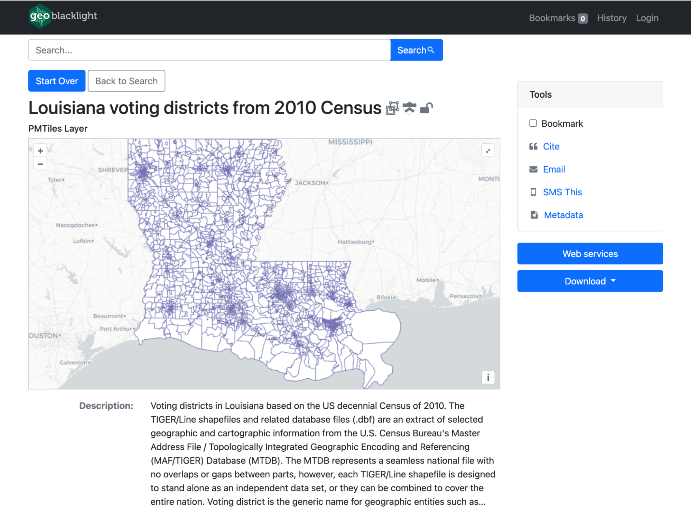

# Winter 2024 Sprint Wrap-up - GeoBlacklight v4.2

## :pushpin: Summary

The GeoBlacklight Community conducted a two-week sprint from January 29 to February 9, 2024, culminating in the release of a [new version of GeoBlacklight](https://github.com/geoblacklight/geoblacklight/releases/tag/v4.2.0). This update not only brings maintenance enhancements but also introduces new viewers for COGs, PMTiles, and IIIF Manifests. Additionally, the community has made substantial improvements to the documentation, making it easier to maintain and more informative for new users.

<!-- more -->

## :fontawesome-solid-glasses: New Viewers in GeoBlacklight

### OpenLayers for viewing modern data formats: COGS and PMTiles 

Version 4.2.0 of GeoBlacklight introduces new viewers for two web-based geospatial data formats: [Cloud Optimized GeoTIFFs (COGs)](https://www.cogeo.org) and [PMTiles](https://docs.protomaps.com/pmtiles/). COGs are an extension of the traditional GeoTIFF file format, optimized for cloud storage and web access, while PMTiles offer a method for storing and accessing numerous map tiles in a single, streamlined file. Both formats are designed to improve efficiency and speed across the web by utilizing HTTP range requests. This allows users to request only parts of the data, rather than entire datasets or images, distinguishing these formats from traditional geospatial web services like WFS or ArcGIS REST services. Both of the new viewers use [OpenLayers](https://openlayers.org) instead of Leaflet, which, up until now, has been the only mapping library for GeoBlacklight. 

Overall, the integration of IIIF Manifests, COGs, and PMTiles into the latest version of GeoBlacklight reflects a growing trend in data sharing, moving away from the convention of offering discrete, downloadable files and toward a more dynamic model of streaming data.

-   
	 
	COGs viewer in GeoBlacklight 	

-   

     PMTiles viewer in GeoBlacklight 

### Clover for IIIF Manifests

{width=40% align=left}

In earlier versions, GeoBlacklight was limited to displaying single-part images through the IIIF Image APIs, requiring anyone interested in showcasing multipart images via IIIF Manifests to integrate a custom viewer. With the release of Version 4.2, this capability is now included by default with [Clover, a viewer developed by the Samvera community.](https://samvera-labs.github.io/clover-iiif/docs)

 

### Baseline support for latest OpenIndexMaps spec v1.0  

{ width=40% align=left}

The OpenIndexMaps project has released [version 1.0](https://openindexmaps.org/specification/1.0.0), an expanded spec that replaced the [legacy version 0](https://openindexmaps.org/specification/0.0.0). There are minor semantic differences between the specs, and we updated GeoBlacklight to support either version.

 

## :construction_site: Maintenance & Framework updates

- Support for Ruby on Rails version 7.1
- Deprecated Faraday
- Implemented [Vite Ruby](https://vite-ruby.netlify.app/), via the [vite-rails](https://vite-ruby.netlify.app/guide/rails.html) Ruby gem

## :notepad_spiral: Documentation Improvements

- Merged the GitHub repositories of the public GeoBlacklight website and the dedicated docs.  This will make it easier to maintain over time and makes searching for information from the main site more fruitful.
- Reorganized the navigation categories and added a Reference section for quick look-up charts
- **New or updated pages**
    - [For Developers](../../docs/developers.md): Added more details and a diagram for new developers
    - [User Authentication](../../docs/user_authentication.md): New page about configuring user accounts and logins
    - [JSONs and GeoJSONs](../../docs/json-geojson.md): New page clarifying the difference between the file formats
    - Redesigned the [Showcase](../../showcase/index.md) grid to include public code repositories.

!!! info "More details"

	### [To read more about version 4.2 and how to upgrade, read the release notes on GitHub.](https://github.com/geoblacklight/geoblacklight/releases/tag/v4.2.0) :material-github:
	
	### [To read more about our sprint activities, browse the GitHub project board](https://github.com/orgs/geoblacklight/projects/3/views/1) :octicons-project-24:

## :sunrise_over_mountains: What's on the horizon?
 
### GeoBlacklight version 5

For the next major release of GeoBlacklight, our objectives require updating our dependencies and frameworks. In the recent sprint, we achieved considerable progress in updating our JavaScript library to ES6 modules and eliminating the dependency on jQuery. These updates are now part of a development branch, which we plan to further refine in the next sprint.

We also plan to upgrade to Bootstrap v5 and Blacklight v8.  [Review our Release Calendar for more details.](../../docs/releases.md)

### Investigating OpenLayers

We have been using Leaflet since the first version of GeoBlacklight, but have begun exploring other mapping libraries, particularly OpenLayers, for some potential future features. 

### Improving the default interface

After we upgrade our libraries, we will finally be able to address the recommendations from 2023's [Maps UX Workgroup](https://docs.google.com/document/d/1ZXfTMGVAjzi5-KUIqshkLFmkPTFpH-G6cHbLl1oGw6k/edit).

!!! tip ""

      Have a suggestion for a GeoBlacklight Version 5? [Get in touch with the community](../../../../community/#how-to-connect) or [create an issue in our GitHub repository](https://github.com/geoblacklight/geoblacklight/issues).

	Thank you to everyone who participated during this sprint! Please consider joining us at the next community sprint coming in Summer 2024.  
	
	-Karen