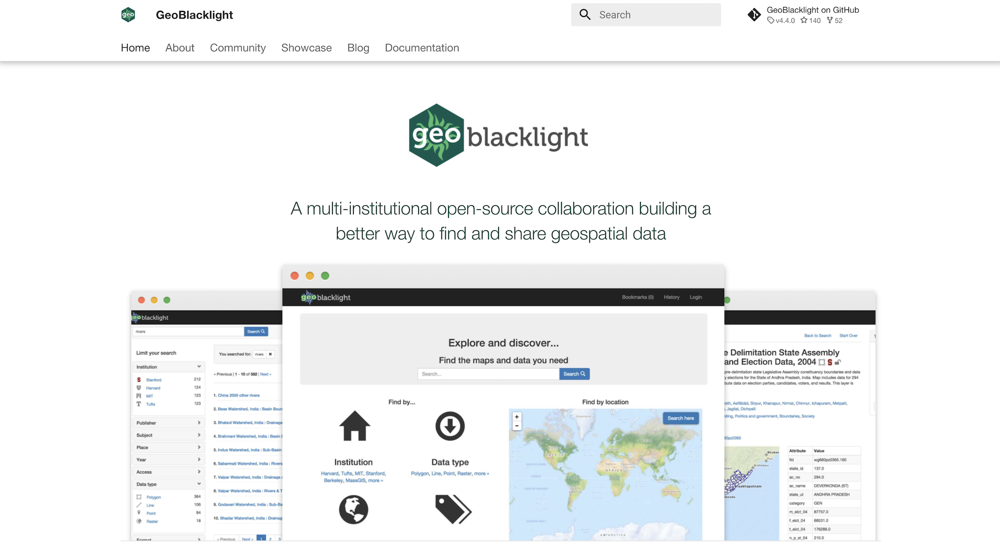
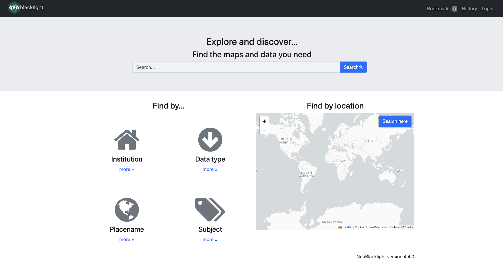
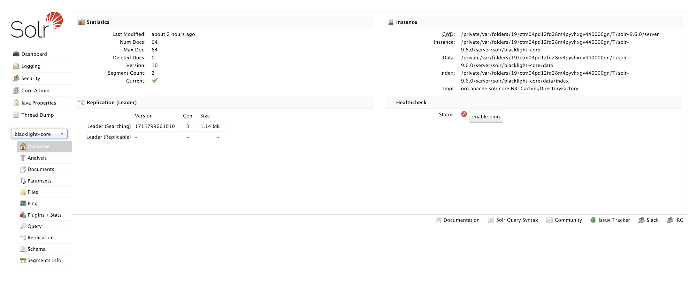
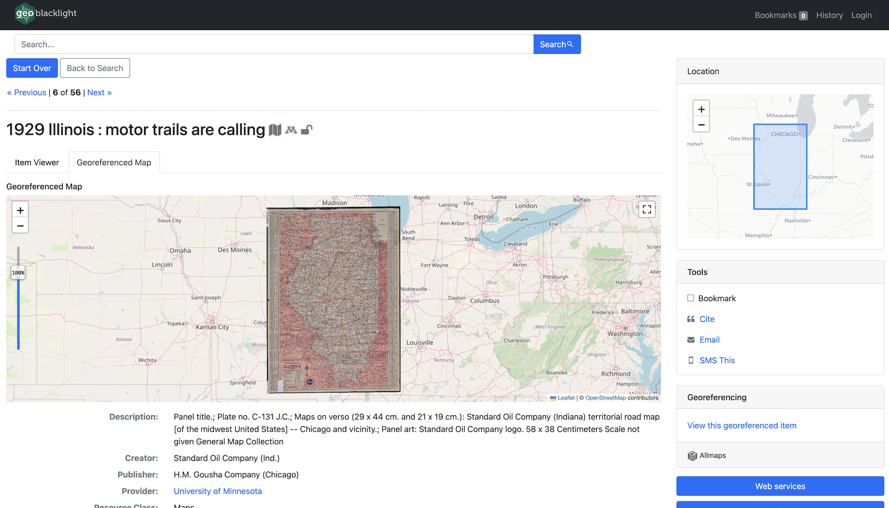
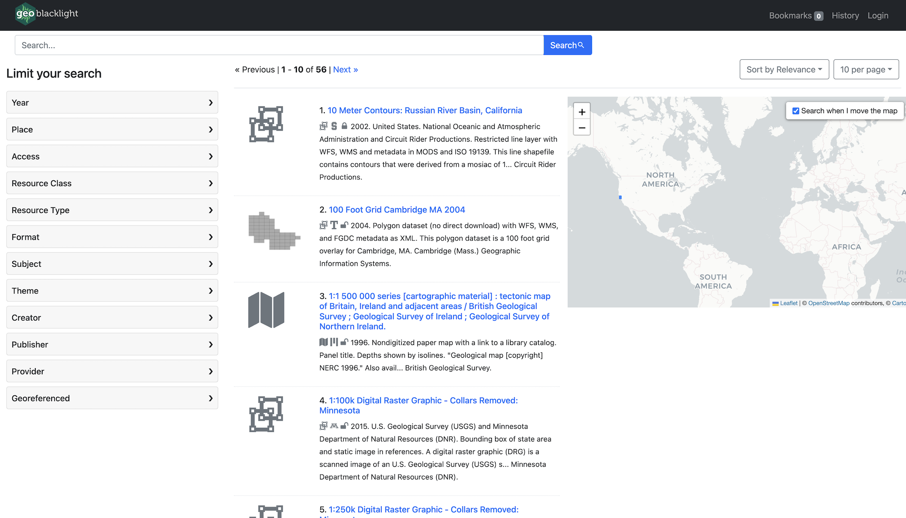

# Geo4LibCamp 2024 / GeoBlacklight Workshop

Workshop date: May 20, 2024

## Facilitators

* Eric Larson — Big Ten Academic Alliance
* Eliot Jordan — Princeton University

With many thanks to all the GeoBlacklight community members who help keep our website and project documentation up to date.

## Part 1: Introductions and Attendee Goals (5 minutes)

Eric and Eliot are both core contributors/maintainers of the GeoBlacklight project's source code. Let's all get to know one another and hear what each attendee wants to learn in this session.

## Part 2: GeoBlacklight for Beginners (30 minutes)

* GeoBlacklight Overview (5 minutes)
* Setting up a GeoBlacklight Environment (5 minutes)
* Create a GeoBlacklight Application (10 minutes)
* Index Solr Documents (10 minutes)

#### Screenshot - Geoblacklight Website



### GeoBlacklight Overview

* What is GeoBlacklight?
* GeoBlacklight Features
* GeoBlacklight Community

#### What is GeoBlacklight?

GeoBlacklight is a [Ruby](https://www.ruby-lang.org/en/) on [Rails](https://rubyonrails.org/) [engine](https://guides.rubyonrails.org/engines.html), based on the popular open-source project [Blacklight](https://projectblacklight.org/). The aim of the project is to provide a simple, effective open-source application for discovery of geospatial data. Many institutions are using GeoBlacklight to provide a search engine across a federated catalog of geospatial data — [GeoBlacklight project showcase](https://geoblacklight.org/showcase/).

#### GeoBlacklight - Key Features

GeoBlacklight extends the functionality of Blacklight by providing the following:

* Text and spatial search with ranking
* Facet by institution, year, publisher, data type, access, format
* Facet by place, subject
* Results list view with icons, snippets, and map view of bounding boxes
* Spatial search on map in result list
* Detail map view for WMS features with feature inspection
* IIIF scanned map viewer
* Download the original file (Shapefile, GeoTIFF, GeoJSON, Esri Geodatabase, GeoPackage, or other SQLite database)
* Download generated Shapefile/GeoTIFF/KML/GeoJSON
* Built-in sample Solr index
* Built on top of Blacklight platform
* Search history
* Bookmark layers
* Share link via email
* Sort by relevance, year, title
* Customizable skin and facets

[GeoBlacklight Key Features](https://geoblacklight.org/about/#key-features)

#### GeoBlacklight - Community

Participants in the GeoBlacklight community come from a variety of professional and intellectual backgrounds (including librarians, software developers, metadata specialists, applied researchers, and others), but we share a common interest in making reliable and high-quality geospatial data easily accessible to members of the research community and the broader public. Many of us work in libraries and other cultural heritage institutions that deploy (or are planning to deploy) GeoBlacklight instances to disseminate and publicize their spatial data collections.

##### Get Involved

* Volunteer for a Community Role
* Join a Workgroup or Interest Group
* Follow our Google Group
* Chat on Slack
* Attend a Monthly Meeting
* Participate in a Community Sprint
* Share Metadata

[GeoBlacklight Community](https://geoblacklight.org/community/)

### Setting Up a GeoBlacklight Environment

You should have the following installed before beginning:

* Ruby — For Ruby on Rails
* Java - Apache Solr runs on Java 11 or greater.

Follow the [GoRails Setup](https://gorails.com/setup) steps to install a Ruby on Rails environment. [Homebrew](https://brew.sh/) can help you install Java on macOS or Windows Subsystem for Linux.

### Create a GeoBlacklight Application

Bootstrap a new GeoBlacklight Ruby on Rails application using the template script:

```bash
DISABLE_SPRING=1 rails new gbl-app -m https://raw.githubusercontent.com/geoblacklight/geoblacklight/main/template.rb
```

Then run the geoblacklight:server rake task to run the application:

```bash
cd gbl-app
bundle exec rake geoblacklight:server
```

* Visit your GeoBlacklight application at: http://localhost:3000
* Visit the Solr admin panel at: http://localhost:8983/solr/#/blacklight-core

#### Screenshot - GeoBlacklight Homepage



#### Screenshot - Solr Admin Panel



### Index Solr Documents

Time to add some data to our application. GeoBlacklight uses OpenGeoMetadata's Aardvark metadata schema.

#### OpenGeoMetadata / Aardvark

[OpenGeoMetadata](https://opengeometadata.org/) (OGM) is a discovery metadata schema for geospatial resources and an open platform for sharing metadata files.

[OGM Aardvark](https://opengeometadata.org/ogm-aardvark/) is a discovery metadata schema for geospatial resources. It was intentionally developed with cross-application in mind and can be used to describe geospatial assets of all kinds. It is also the newest metadata application profile schema for GeoBlacklight. Launched in 2021, it replaces the GeoBlacklight metadata schema version 1.0 (GBL 1.0). Compared to GBL 1.0, Aardvark incorporates additional fields for better descriptions of a wider range of resources, as well as syntactical updates in order to improve interoperability between institutions and between schemas.

#### Rake Tasks

With your Solr server and Rails server already running (via the geoblacklight:server rake task above), open a new terminal window and index the GeoBlacklight project's test fixtures (OGM Aardvark JSON files) via the rake task below:

```bash
bundle exec rake "geoblacklight:index:seed[:remote]"
```

#### GeoCombine

Another option for indexing data is [GeoCombine](https://github.com/OpenGeoMetadata/GeoCombine). GeoCombine is a Ruby toolkit for managing geospatial metadata, including:

* Tasks for cloning, updating, and indexing OpenGeoMetadata metadata
* Library for converting metadata between standards

Example harvest from a single repository
```bash
bundle exec rake geocombine:clone\[edu.umn\]
```

Index your GeoCombine data. Here we're setting our schema version to Aardvark, which is the GBL v4.0+ metadata schema.

```bash
SCHEMA_VERSION="Aardvark" bundle exec rake geocombine:index
```

## BREAK and Q&A Session (10 minutes)

Eric will return to this tutorial to list the attendee questions and discussion topics from this break (I promise).

## Part 2: Advanced GeoBlacklight (40 minutes)

Using local configuration options and adding community plugins to customize your GeoBlacklight instance. 

* Local config: settings.yml (5 minutes)
* Local config: catalog_controller.rb (5 minutes)
* Plugin: Blacklight::Allmaps (10 minutes)
* Plugin: GeoBlacklight Sidecar Images (10 minutes)
* Plugin: GeoBlacklight Admin (10 minutes)

### Local config: settings.yml (5 minutes)

In your local GeoBlacklight application, the first file that provides considerable customization and configuration options is `settings.yml`. This file is specific to GeoBlacklight and it sets constant variables for the application to use, including:

* APPLICATION_LOGO_URL
* BBOX_WITHIN_BOOST
* HOMEPAGE_MAP_GEOM
* FIELDS
* WEBSERVICES_SHOWN
* DISPLAY_NOTES_SHOWN
* RELATIONSHIPS_SHOWN
* and more...

This file is loaded into the application via the Ruby [config](https://github.com/rubyconfig/config) gem.

### Local config: catalog_controller.rb

The next significant place where customizations and configuration options occur is within the `app/controllers/catalog_controller.rb` file.

Within this file, you'll find options to define/set:

* Maps > Default Leaflet basemap (config.basemap_provider)
* Solr > Default solr params (config.default_solr_params)
* Search Results > Per Page option (config.default_per_page)
* Search Results > Sort options (config.add_sort_field)
* Search Results > Define your list of facets (config.add_facet_field)
* Search Results > Define your displayed metadata fields (config.add_index_field)
* Show Page > Define your displayed metadata fields (config.add_show_field)
* Show Page > Define Sidebar Tool options (config.add_show_tools_partial)

### Plugin: Blacklight::Allmaps

Let's add support for [Allmaps](https://allmaps.org/) georeferenced maps to our example application — we had two lighting talks on Allmaps this morning: Open-Source Georeferencing and Curating with Allmaps | [Blacklight::Allmaps](https://docs.google.com/presentation/d/1Pn81E1JS0CLn10lZWCpv-hwWcYYwtJkpxiiU6To61P0/edit?usp=sharing) (slidedeck).

#### Install

Follow the [blacklight_allmaps](https://github.com/bplmaps/blacklight-allmaps?tab=readme-ov-file#installation) installation steps to add this plugin to our Gemfile.

```ruby
# Gemfile
gem "blacklight_allmaps"
```

And then execute:
```bash
bundle install
```

Run the generator script:

```bash
# For GeoBlacklight
LIGHT=geoblacklight bundle exec rails generate blacklight:allmaps:install
```

#### Seed Fixtures

To populate Solr with some example data, you can run these tasks

```bash
# For GeoBlacklight...
LIGHT=geoblacklight rake blacklight_allmaps:index:gbl_fixtures
```

#### Harvest Allmaps IIIF Annotation Data

We harvest and store Allmaps IIIF Annotation data locally. The rake task here kicks off a background harvest process that walks through your Solr index documents (using CursorMark) and checks each document for `georeferenceable?` - the presence of a IIIF Manifest. If the document is indeed georeferenceable? (true) we ping the Allmaps API to determine if the map/item has already been georeferenced in Allmaps.

```bash
# For Blacklight or GeoBlacklight
bundle exec rake blacklight_allmaps:sidecars:harvest:allmaps
```

#### Populate the Georeferenced Facet

We expose the georeferenced items in the Blacklight user interface via a Georeferenced facet:

```bash
# For Blacklight or GeoBlacklight
bundle exec rake blacklight_allmaps:index:georeferenced_facet
```

#### Screenshot - Item Show Page



[Example](http://localhost:3000/catalog/p16022coll230:4038)

### Plugin: GeoBlacklight Sidecar Images

This plugin adds thumbnails to search results. Let's follow the [installation steps](https://github.com/geoblacklight/geoblacklight_sidecar_images?tab=readme-ov-file#installation) to add this feature to our example application.

#### Install

Add this gem to our Gemfile.

```ruby
# Gemfile
gem "geoblacklight_sidecar_images", "~> 1.0"
```

Bundle.

```bash
bundle install
```

Run the generator.

```bash
bin/rails generate geoblacklight_sidecar_images:install
```

Run the database migration.

```bash
bin/rails db:migrate
```

Set your variant processor to `:vips` in `config/application.rb`. This will use [libvips](https://www.libvips.org/) to generate our thumbnails.

```bash
    # Image Processing
    config.active_storage.variant_processor = :vips
```

#### Harvest Thumbnails

Spawn some background jobs to harvest images for all the documents in our Solr index. In development mode, these will run "inline". In a production environment, you'd want to use 

```bash
bundle exec rake gblsci:images:harvest_all
```

#### Screenshot - Item Show Page



[Example](http://localhost:3000/catalog/p16022coll230:4038)

### Plugin: GeoBlacklight Admin

Notice: This is going to be a full pivot from our current example codebase we've been building.

[GeoBlacklight Admin](https://github.com/geobtaa/geoblacklight_admin) is a GeoBlacklight plugin, built on [Kithe](https://github.com/sciencehistory/kithe), that provides a CSV-based import/export workflow for OpenGeoMetadata's Aardvark schema, rich web-forms for editing documents, and publication lifecycle tools for working with draft documents or published data. GBL Admin is also the Big Ten Academic Alliance's production workflow tool.

#### Installation

* Create PG database:

```bash
psql postgres
CREATE DATABASE geoblacklight_development;
```

* Run application template install script below:

```bash
rails _7.1.3.2_ new gbl-admin -m https://raw.githubusercontent.com/geobtaa/geoblacklight_admin/develop/template.rb
```

Run the Application
```bash
bundle exec rake geoblacklight:server
```

