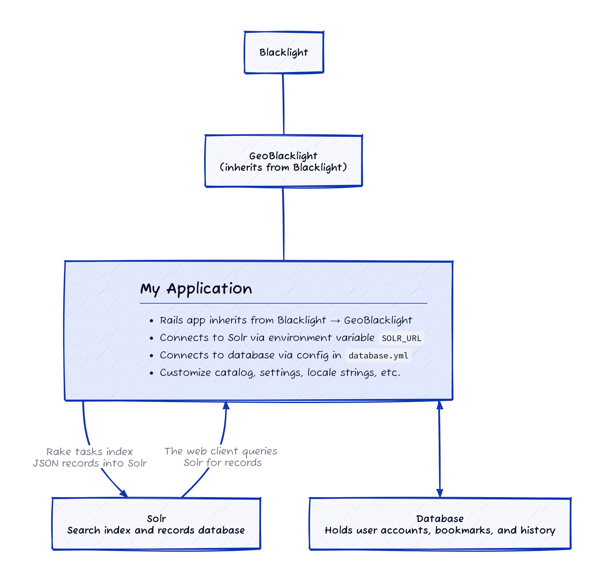

# For Developers

This page is for software developers looking to build GeoBlacklight from source, especially to contribute code to the core application.

!!! tip "Creating a custom application"

    If you are looking to start a new, branded and customized GeoBlacklight application for your institution, follow the [Quick Start](geoblacklight_quick_start.md) instructions. The application you create will inherit from the latest stable GeoBlacklight release. See the architecture diagram below for more context.

---------

## Dependencies

You should have the following installed before beginning:

<ul>
    <li>Ruby > 3.0.0</li>
    <li>Java > JRE version 11 or higher</li>
</ul>
---------

## Build the Application

Clone the code base from the official GeoBlacklight repository or from your own fork if you plan to make upstream pull requests.

```
$ git clone git@github.com:geoblacklight/geoblacklight.git
```

Once cloned, enter the repository and install dependencies:

```
$ cd geoblacklight
$ bundle install
```

Now initialize and start the application:

```
$ bundle exec rake geoblacklight:server
```

This command will executes all of the following steps and leave you with a running a local instance of GeoBlacklight:

- Download, configure, and start a local Solr instance
    - Located in `tmp/solr`
- Seed this Solr instance with test fixtures
    - JSON file fixtures located in `spec/fixtures/solr_documents/`
- Create a test application
    - Located in `.internal_test_app/`
- Create a development database within the test application
    - Located at `.internal_test_app/storage/development.sqlite3`
    - Database connection defined in `.internal_test_app/config/database.yml`
    - ActiveRecord supports PostgreSQL, SQLite, and MySQL ([learn more](https://guides.rubyonrails.org/configuring.html#configuring-a-database))
- Run the Rails server

!!! tip "Troubleshooting"

    If you run into issues running this rake task, try removing your `Gemfile.lock` file and removing the test app with `rm -R .internal_test_app`. Then run `bundle install` before running the above command again.

You should now be able to visit [http://localhost:3000/](http://localhost:3000/) in a web browser and see the test application. If you modify content in the test application, these changes will be reflected on browser refresh. This may be a good time to learn more about the GeoBlacklights's structure:



In the diagram above, "My Application" is actually the local test application, `.internal_test_app`, and it is analogous to the standalone Rails application that you would create through the [Quick Start](/documentation/geoblacklight_quick_start) instructions.

### Running Solr and Rails server separately

You may decide to run either the Solr server or Rails server separately. With Solr, for instance, run
```
$ rake geoblacklight:solr
```
Then, open another Terminal window, navigate to the place where your app is located, and run:
```
$ rake engine_cart:server
```
Once the server is running, you can open a web browser and visit the URL it prompts, usually [http://localhost:8983/solr/#/blacklight-core](http://localhost:8983/solr/#/blacklight-core) to see the admin interface of your test instance of Solr. As before, remember that ^C (ctrl + c) stops the server.

You may also want to use an external Solr instance, especially in production. You can read more about that [here](/documentation/external_solr).

---------

## Unit Testing

### Running all the tests
As you develop and make changes, you may want to run tests on parts of the app to see if any warning occur. You can run the following to test the app
```
$ rake ci
```
Note that a test like this could take up to 5-6 minutes to complete, or longer. Warnings, deprecations, and other messages will be printed on your Terminal screen.

### Running the tests separately
```
$ rake geoblacklight:solr
```
Then, in another terminal window:
```
$ rspec spec/
```
*Note:* It is not necessary to run tests after every change you make. You can, for instance, change the name of a facet field, save your file, and then refresh your browser to see the change. However, if you add a new fixture metadata record, you will have to stop the servers and then restart them so the new file will be indexed.
---------

## Browser Testing

Cross-browser testing provided by:

<a href="https://www.browserstack.com/"></a>

## Helpful Development Tools

### Version Managers
Using version management tools for compatible versions of Ruby ([rvm](https://rvm.io/), [rbenv](https://github.com/rbenv/rbenv/), [asdf](https://asdf-vm.com/)) and Node ([nvm](https://github.com/nvm-sh/nvm/blob/master/README.md), [asdf](https://asdf-vm.com/)) can make development easier.

#### asdf
Many developers like asdf because you can manage versions for Ruby and Node in a single utility. For developers who use asdf, it is helpful to add a `.tool-versions` file for each app.

Example:
```
ruby 2.7.5
nodejs 17.4.0
java openjdk-11.0.2
```

---
