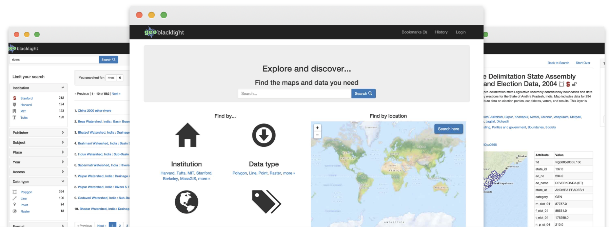

---
hide:
  - toc
  - navigation
---

<h1 style="text-align: center;">GeoBlacklight</h1>

<h2 style="text-align: center;">A multi-institutional open-source collaboration building a  better way to find and share geospatial data</h2>

<h2 style="text-align: center;">How can the Geoblacklight Community  help you?</h2>

	

<h3 style="text-align: center;">Participating institutions</h3>
<ul>
<li>GeoBlacklight provides a customizable platform for delivering geospatial information seamlessly to end users</li>
<li>Participants can connect to other contributors through our active <a href = "connect">communication channels</a> and learn best practices for software and metadata implementation.</li>
</ul>

<h3 style="text-align: center;">End users</h3>
<ul>
<li>GeoBlacklight makes geospatial resources accessible to all users regardless of expertise with user-friendly searches through a map interface, keyword searches, and faceted browsing.</li>
<li>GeoBlacklight provides easy download and export options for reusing geospatial resources in a wide variety of academic ventures.</li>
</ul>

