---
hide:
  - toc
  - navigation
---

# GeoBlacklight Project Showcase

-   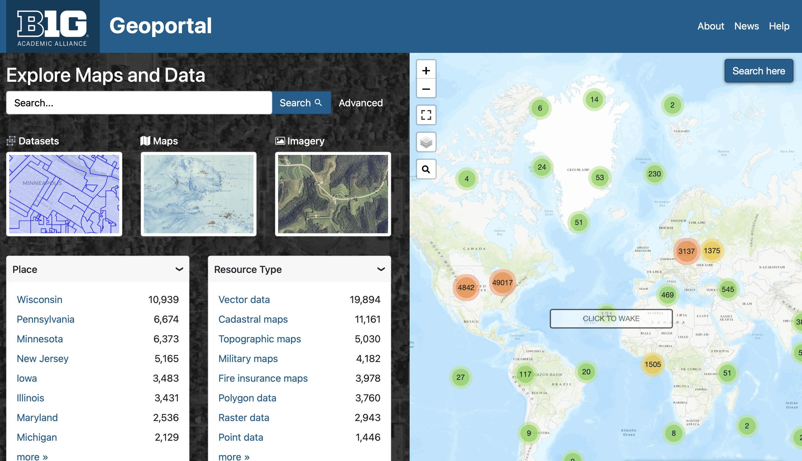

	#### [Big Ten Academic Alliance Geoportal](https://geo.btaa.org)
	
	The Big Ten Academic Alliance Geoportal aggregates metadata from 12 different institutions providing a single place to find and use aerial imagery, geospatial data, and scanned maps from multiple GIS data clearinghouses and library catalogs.
	  
	:octicons-link-external-16: https://geo.btaa.org
	  
	:simple-github: https://github.com/geobtaa/geoportal

-   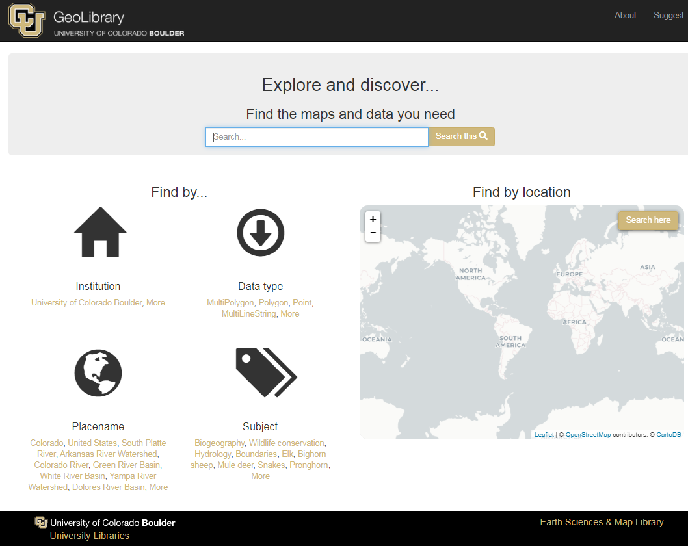

	#### [Colorado GeoLibrary](https://geo.colorado.edu/)
	The Colorado GeoLibrary is a venture of the University of Colorado Boulder Libraries. The GeoLibrary provides geospatial data access to the University of Colorado and beyond. The purpose of the GeoLibrary is to collect and provide access to data from across the State of Colorado in service of our students and researchers, as well as the general public.
	  
	:octicons-link-external-16: https://geo.colorado.edu/

- 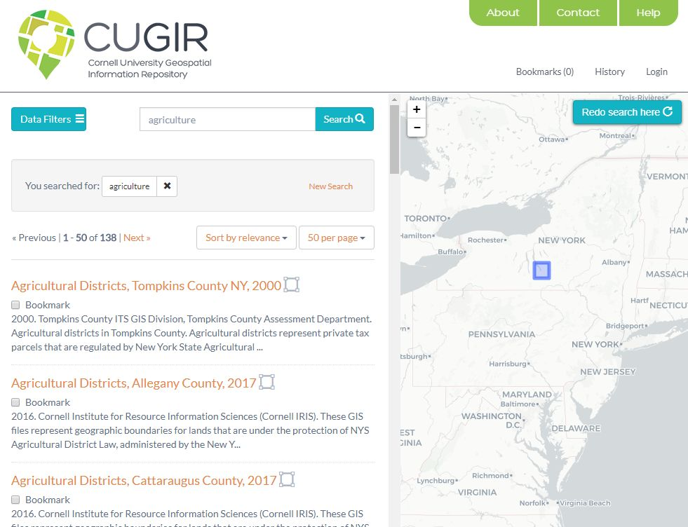

	#### [CUGIR - Cornell University Geospatial Information Repository](https://cugir.library.cornell.edu/)
	
	CUGIR provides free and open access to geospatial data for New York State, as well as worldwide geospatial data created by Cornell researchers.
	
	:octicons-link-external-16: https://cugir.library.cornell.edu/

- 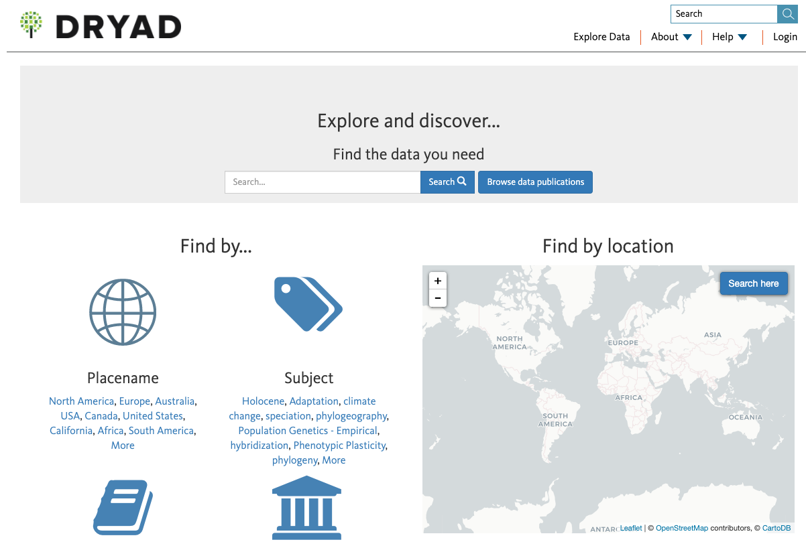

	#### [Dryad](https://datadryad.org/search)
	
	The Dryad Digital Repository is a curated resource that makes research data discoverable, freely reusable, and citable. Dryad provides a general-purpose home for a wide diversity of data types, and it participates in the Data Curation Network.
	
	:octicons-link-external-16: https://datadryad.org/search

- 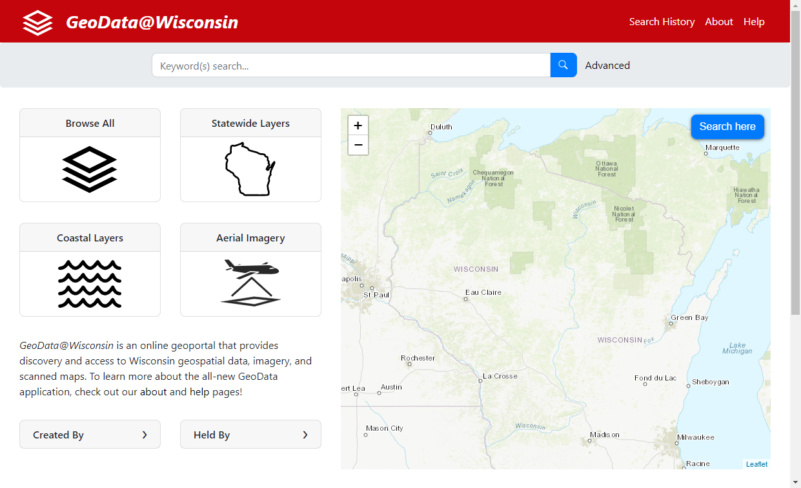

	#### [GeoData@Wisconsin](https://geodata.wisc.edu)
	  
	GeoData@Wisconsin is an online geoportal that provides discovery and access to Wisconsin geospatial data, imagery, and scanned maps.  GeoData@WI represents the holdings of the University of Wisconsin Robinson Map Library archives, plus all known open data portals maintained by Wisconsin geospatial data producers.
	
	:octicons-link-external-16: https://geodata.wisc.edu

- 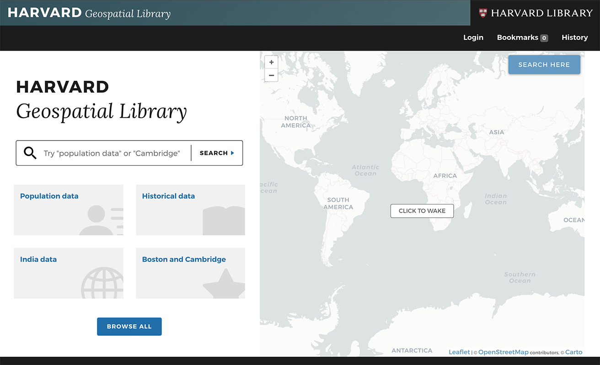

	#### [Harvard Geospatial Library](https://hgl.harvard.edu/)

	The Harvard Geospatial Library provides access to a wealth of geospatial data and maps from the Harvard Library as well as many other partner institutions. Users can conduct map based searches of HGL's catalog and find materials that are ready to use in a GIS, from modern census boundaries and data to images of early maps of the world.
	
	:octicons-link-external-16: https://hgl.harvard.edu/

- 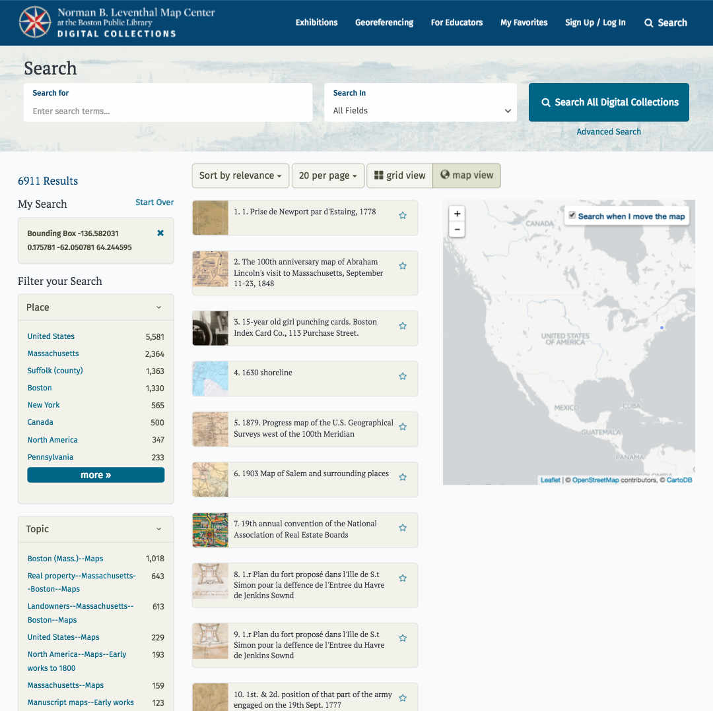

	#### [Norman B. Leventhal Map Center - Collections](https://collections.leventhalmap.org/search?utf8=%E2%9C%93&q=)
	  
	The Norman B. Leventhal Map Center at the Boston Public Library offers a customized discovery experience for its map collection. This unique application combines GeoBlacklight with the ability to georeference maps and create custom map sets for instruction.
	
	:octicons-link-external-16: https://collections.leventhalmap.org/search?utf8=%E2%9C%93&q=

- 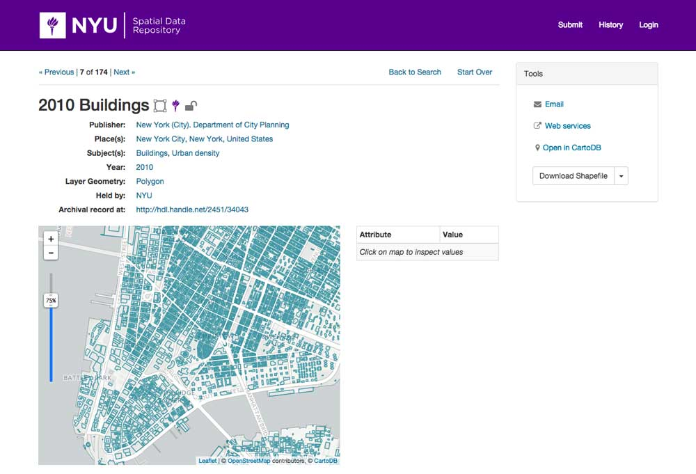

	#### [NYU - Spatial Data Repository](https://geo.nyu.edu)
	
	The NYU Spatial Data Repository is a search and discovery platform for geospatial data created by NYU's Data Services. The application is the entry point for discovering and accessing NYU's spatial data collections.
	
	:octicons-link-external-16: https://geo.nyu.edu

- 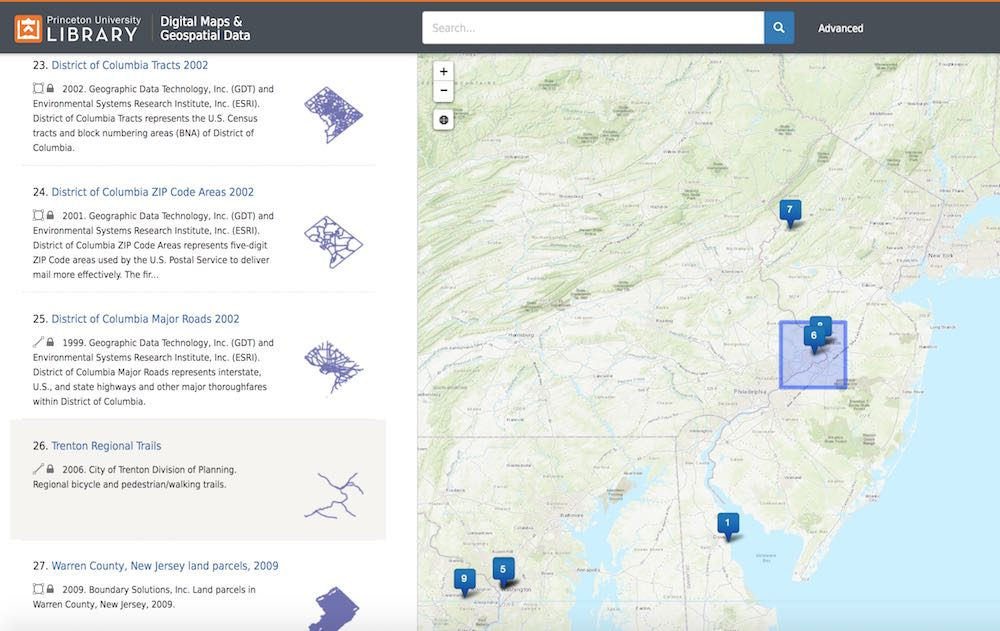

	#### [Princeton University - Digital Maps and Geospatial Data](https://maps.princeton.edu)
	  
	The Digital Maps and Geospatial Data tool allows users to search for datasets and scanned historical maps from within the Princeton University Library's own collections, as well as the collections of other institutions.
	
	:octicons-link-external-16: https://maps.princeton.edu
	
	:simple-github: https://github.com/pulibrary/pulmap

- 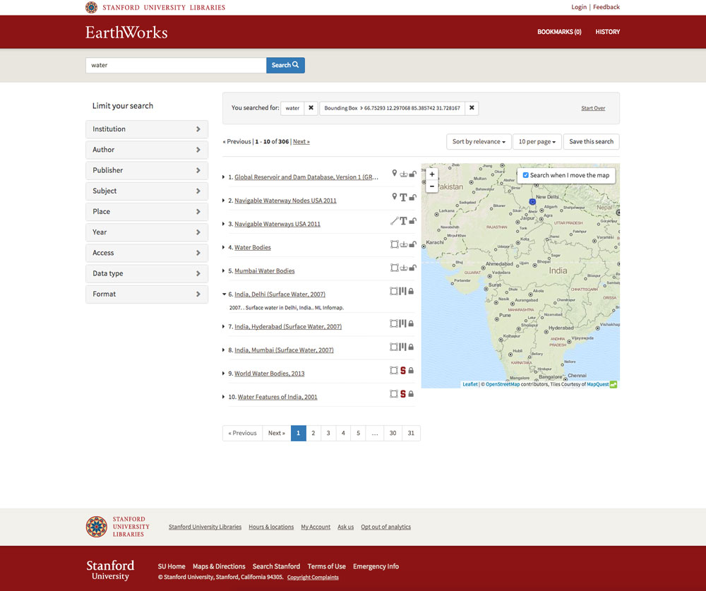

	#### [Stanford University - EarthWorks](https://earthworks.stanford.edu)
	
	EarthWorks is Stanford University Libraries discovery tool for Geographic Information Systems (GIS) data. It combines data sources from many institutions allowing users to search through tens of thousands of geospatial datasets.
	
	:octicons-link-external-16: https://earthworks.stanford.edu

- 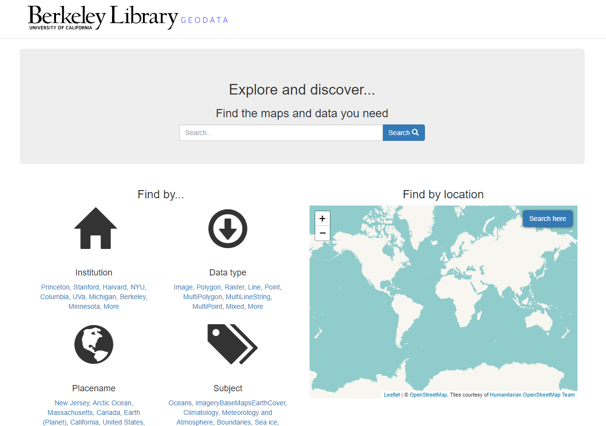

	#### [University of California Berkeley – GeoData Portal](https://geodata.lib.berkeley.edu/)

	The UC Berkeley Library developed GeoData@UC Berkeley to help users find geospatial data and maps. Much of the content is freely available, but some datasets are restricted to UC Berkeley affiliated users.
	
	:octicons-link-external-16: https://geodata.lib.berkeley.edu/

- 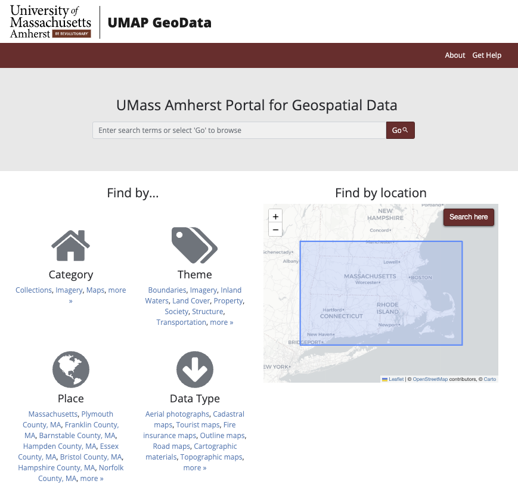

	#### [University of Massachusetts Amherst – Portal for Geospatial Data](https://geodata.library.umass.edu/)
	
	UMAP GeoData is the UMass Amherst Libraries' discovery platform for finding geospatial content, including datasets, aerial photos, and scanned maps. All content is publicly available.
	
	:octicons-link-external-16: https://geodata.library.umass.edu/

- 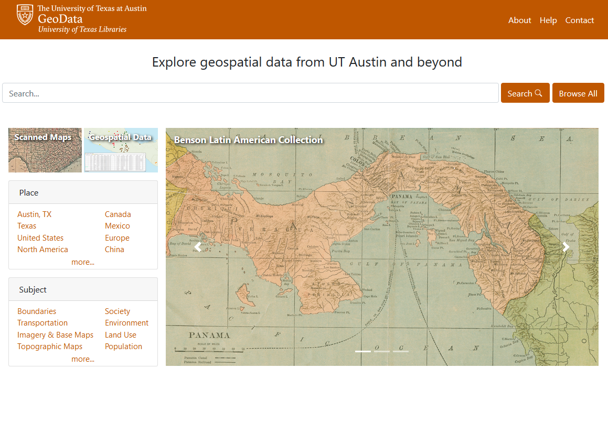

	#### [University of Texas at Austin - Texas GeoData Portal](https://geodata.lib.utexas.edu/)
	
	The Texas GeoData portal is an online interface designed to make it easy for users to search and browse for geospatial data from the collections of the UT Libraries at the University of Texas at Austin and from the collections of other institutions.
	
	:octicons-link-external-16: https://geodata.lib.utexas.edu/

## Add to the Showcase

If your institution or organization has adopted GeoBlacklight and you would like to add your instance to the project page, [see the instructions to contribute](submit.md).
