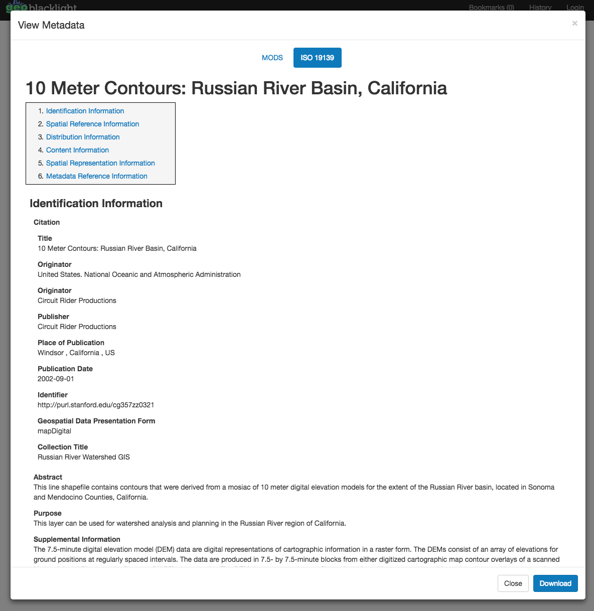

# Summer Code concludes and GeoBlacklight version 1.6.0 released

The second annual GeoBlacklight Community Code has concluded and a new version (1.6.0) has been released with improved views for standards-based metadata files along with several bug fixes.

<!-- more -->

### Summarizing the GeoBlacklight Community Code: Summer 2017

Developers and metadata specialists from New York University, Princeton University, and the Big Ten Academic Alliance participated in the second GeoBlacklight Summer Code from July 24 - August 4, 2017. With input from developers at Stanford University, Lewis & Clark College, VecNet, and Cornell University, theers [selected a number of goals to work on](https://github.com/geoblacklight/geoblacklight/labels/2017%20Summer%20Community%20Sprint), including bug fixes, upgrading dependent libraries, improving the user interface, and exploring changes to the metadata schema. As of August 23, [GeoBlacklight version 1.6.0 has been released](https://github.com/geoblacklight/geoblacklight/releases/tag/v1.6.0). Major thanks to Eliot Jordan, Stephen Balogh, James Griffin, Eric Larson, and Jack Reed for contributing code actively during the summer.

### Changes and Implementations

The code and release of version 1.6.0 resulted in a significant new feature, an amazing [tabbed viewer](https://github.com/geoblacklight/geoblacklight/pull/555) that displays standards based XML metadata as HTML in the interface. This was primarily developed by James Griffin, and represents an enhancement that has long been requested by many GeoBlacklight users. Now, users can see a cleaner rendering of ISO or FGDC XML documents in context and download them.

The were also a number of behind the scenes minor code changes, including updates to fixture records, validation of bounding boxes, and a webkit deprecation. To simplify organizational structure, the separate GeoBlacklight Schema repository was deprecated and instead [placed as a folder](https://github.com/geoblacklight/geoblacklight/tree/master/schema) within the main repository.  

### Forthcoming Work: Changes in the Schema

Exploration of a larger development was initiated during the, which led the team to discuss migrating GeoBlacklight metadata to a DCAT based metadata schema. The biggest evolution is the adoption of fields and concepts associated with the [Data Catalog Vocabulary (DCAT)](https://www.w3.org/TR/vocab-dcat/) standard and the [Project Open Data Metadata Schema, V. 1.1](https://project-open-data.cio.gov/v1.1/schema/), including distribution fields. Distribution fields allow for increased flexibility in providing links to download multiple formats, pointing to reference codebooks and documentation, and integrating seamlessly with web APIs, such as GeoServer and IIIF endpoints. In the coming months, we expect the user interface of GeoBlacklight to reflect some of these new possibilities.

For now, the team has created a development branch of GeoBlacklight for the new schema that includes example [fixture documents](https://github.com/geoblacklight/geoblacklight/tree/json-ld-schema/spec/fixtures/jsonld) of DCAT-compliant records. There are implications for moving toward the DCAT standard, the most significant of which is the need to "flatten" fully realized .JSON-LD metadata into .JSON files that comply with the Solr cores behind GeoBlacklight. [GeoCompile](https://github.com/geoblacklight/geo_compile), developed by Eliot and Stephen, is an initial step at making sure this happens seamlessly. Major thanks to Karen Majewicz, Andrew Battista, Stephen Balogh, and Eliot Jordan for doing some thinking and mocking-up during the.

These projects are still in progress and will be completed in the coming months. When we finish mocking up the proposed changes, which are gestured in the fixture record, we will follow up with a more complete post that explains the rationale for choices made and solicits further feedback from the community before any adoptions take place. Thanks to everyone who contributed to the. In the meantime, we welcome comments and questions; [follow or contribute to the GeoBlacklight development work on GitHub!](https://github.com/geoblacklight/geoblacklight)
