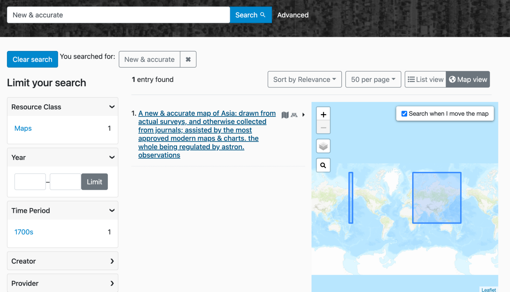
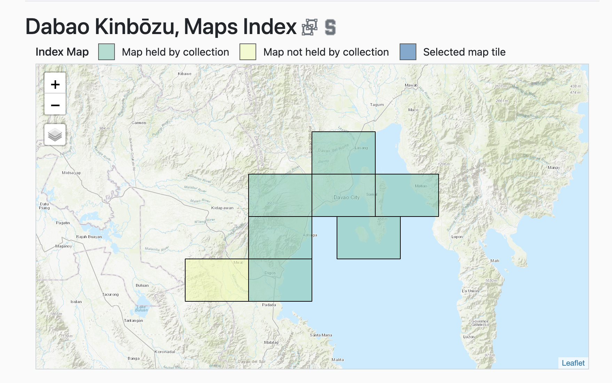

# GeoBlacklight Community Sprint Recap, Winter 2022

The latest GeoBlacklight Community Sprint took place from February 14-25, 2022. Long time GeoBlacklight sprinters have noted that this was likely our most productive event and undoubtedly featured the most active participants. We had over a dozen participants representing Cornell, Harvard, Johns Hopkins University, Princeton, Stanford, UMass Amherst, and the University of Minnesota / Big Ten Academic Alliance. Moreover, five contributors made their very first code commits to GeoBlacklight during this event. 

<!-- more -->

Here are links to five tangible outcomes that we developed during the two-week sprint:

1. Production release of [GeoBlacklight, version 3.6.0](https://github.com/geoblacklight/geoblacklight/releases/tag/v3.6.0)
1. Release candidate of [GeoBlacklight, version 4.0.0-rc1](https://github.com/geoblacklight/geoblacklight/releases/tag/v4.0.0-rc1)
1. New metadata website: [opengeometadata.org](https://opengeometadata.org)
1. Migrated guides for GeoBlacklight development: [geoblacklight.org/guides](https://geoblacklight.org/guides)
1. New version of [GeoCombine](https://github.com/OpenGeoMetadata/GeoCombine/releases/tag/v0.6.0)

## Highlights

### New locations for documentation
All documentation for the GeoBlacklight community has been moved **away from** the GitHub Wiki. Information about GeoBlacklight, development, and customization can now be found on the [Guides section of this website](https://geoblacklight.org/guides.html). All metadata documentation has been migrated to [opengeometadata.org](https://opengeometadata.org).

### New metadata website & tools
Last year, our community developed a new metadata schema for GeoBlacklight, lovingly called *Aardvark*. This new schema is a significant change:  it emphasizes interoperability and the unique characteristics of geodata & maps, so we decided to begin promoting it as an all-purpose discovery schema for geospatial resources. To that end, we launched a new website, [opengeometadata.org](https://opengeometadata.org) that includes detailed schema documentation, guides, and examples. 

We also released a new update of [GeoCombine](https://github.com/OpenGeoMetadata/GeoCombine), a tool within OpenGeoMetadata for programmatically ingesting and converting metadata. This update includes improvements in (1) how it harvests from OpenGeoMetadata repositories and (2) the transformation template for FGDC to HTML. 

### Spatial geometry for search and display
We finally cracked a long-standing spatial problem while simultaneously enabling a long-desired enhancement. 

* **A Problem:** bounding boxes that crossed the antimeridian would appear flipped or backward in search previews. 
* **A related desired enhancement:** to be able to display complex or multiple geometries in search previews instead of just a single bounding box.
* **Our solution:** We incorporated a new option for a spatial metadata field that can use any WKT POLYGON or MULTIPOLYGON for display and searches. This enhancement was built with Geo3D for Solr and opened up the possibilities for what kind of geometries the metadata can feature. This also solves the antimeridian problem, as the metadata can now have two adjacent bounding boxes that will display correctly. [Read more about how to format the Geometry field in OpenGeoMetadata to take advantage of this new feature](https://opengeometadata.org/ogm-aardvark#geometry).

*Image Caption - Two bounding boxes*

### Accessibility & user interface improvements
We improved the layout of the item pages in the default GeoBlacklight user interface in a few ways:

1. The map preview is now above the metadata
2. Added a full-screen option to the map preview
2. Web services and downloads were converted from text links to "Call-to-Action" type buttons
3. Updated the index map to use a more accessible color palette and added a legend

*Image Caption - The map is now directly below the title and has a full-screen option. There is also a new button for web services and an adjusted dropdown button for Downloads*

*Image Caption - Shows improved colors and a legend above the index map*

### Blacklight + future alignment plans
Whenever possible, we make a concentrated effort to align with the development practices of our underlying framework application, [Blacklight](https://projectblacklight.org). During the sprint, we collaborated with Blacklight developers to clear up deprecation warnings and remove an override customization used for bounding boxes. 

For the future, we decided to eventually **remove jQuery** dependencies. This will help us stay consistent with Blacklight and eventually upgrade to **Bootstrap 5**. We also plan to rewrite our JavaScript code using the more modern version, **ES6**.

## Future plans
- Over the next six months, selected institutions will **test the release candidate 4.0**, which includes full Aardvark metadata support and all of the new features developed during the sprint. 
- We plan to schedule a **dedicated documentation sprint** that will include a broad cross-section of skills within our community.

---
For even more details, view our [running notes](https://docs.google.com/document/d/11WH53ZQma51AbkYmBPEJkZAsX9sIj5dl-_cSlbTDE3Q/edit?usp=sharing) from the daily standups and the GitHub projects boards for [development](https://github.com/geoblacklight/geoblacklight/projects/19) and [metadata](https://github.com/orgs/OpenGeoMetadata/projects/1).
