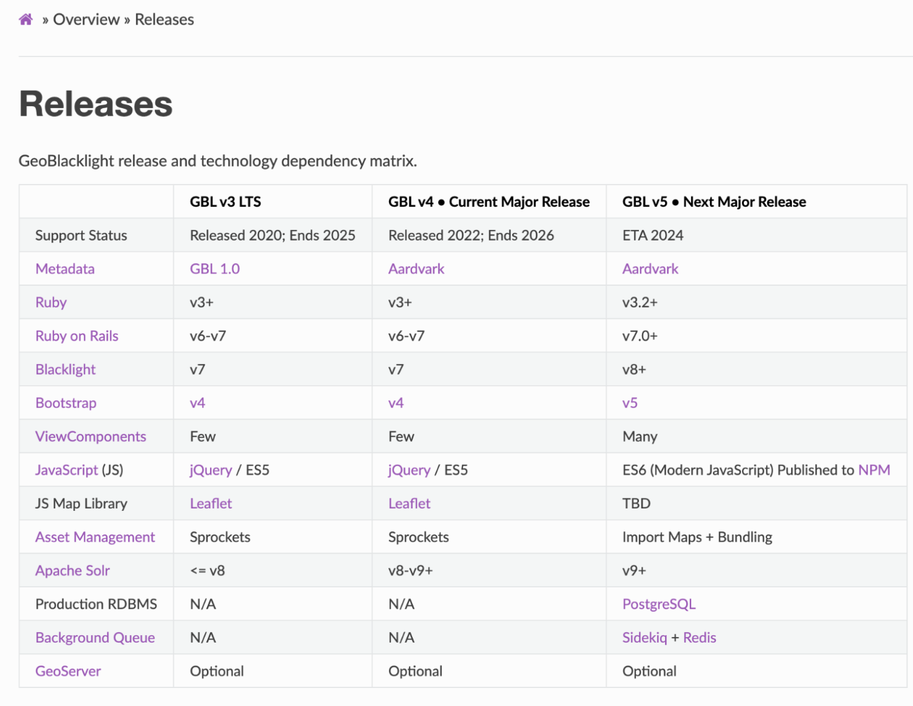

# Winter sprint 2023

The latest sprint resulted in several new outcomes: a metadata field, multiple documentation pages, a release of the Sidecar Images plugin, and a dockerized container for GeoBlacklight.

<!-- more -->

!!! info "KEY LINKS"

	* [Documentation for new Aardvark field, **Display Note**](https://opengeometadata.org/ogm-aardvark/#display-note)
	* [GeoBlacklight release and technology dependency matrix.](https://geoblacklight.org/docs/overview/releases/)
	* [Sidecar Images Plugin](https://github.com/geoblacklight/geoblacklight_sidecar_images)
	* [Dockerized GeoBlacklight](https://github.com/harvard-lts/GeoBlacklightDockerized)

------

Seven members of the GeoBlacklight Community participated in a one-week sprint for the week of February 27 - March 3, 2023. We focused on organizing the [open issues for OpenGeoMetadata](https://github.com/orgs/OpenGeoMetadata/projects/2/views/3) as well as how to plan for upcoming challenges with adopting the beta version of [Blacklight 8.0](ttps://github.com/projectblacklight/blacklight/releases/tag/v8.0.0.beta1).  

The sprint resulted in several new outcomes: a metadata field, multiple documentation pages, a release of the Sidecar Images plugin, and a dockerized container for GeoBlacklight.


## New metadata field, "Display Note", added to OpenGeoMetadata, version Aardvark.

Many institutions using GeoBlacklight have implemented custom fields to display warnings or tips to users. These fields are used to highlight important information about a resource that users need to be aware of before accessing or using it. For example, a warning might indicate that the resource is incomplete or may be difficult to use due to technical limitations. A tip might provide guidance on how to use the resource effectively, such as suggesting specific software or tools that are compatible with the data. 

The main downside of custom fields is that they are not interoperable; when we share metadata across institutions, this information is lost. Another drawback is that custom fields require local development time to implement as opposed to functionality that comes with GeoBlacklight out-of-the-box.

During the sprint, [we devised a single field to capture this information, called "Display Note"](https://opengeometadata.org/ogm-aardvark/#display-note). This versatile field is inspired by website widgets known variably as *callouts* (general usage), [admonitions](https://python-markdown.github.io/extensions/admonition/) (Python Markdown), or [alerts](https://getbootstrap.com/docs/4.0/components/alerts/) (Bootstrap). Callouts are generally highlighted in colors and/or icons that indicate the type of information being offered, such as a red background for a Warning.  

Details about the new field:

* URI: `gbl_displayNote_sm`
* Multiplicity: this field is an array that can have multiple values
* Syntax: *type of callout*: *text of callout*
* Example value:  
```
[
"Warning: This text (starting with 'This text') will be displayed in a red box",
"Info: This text (starting with 'This text') will be displayed in a blue box",
"Tip: This text (starting with 'This text') will be displayed in a green box",
"This is text without a tag and it will be assigned the default 'note' style"
]
```

Right now, the field can be added to your GeoBlacklight Solr instance as a simple string field. In the next sprint, [we plan to add functionality to GeoBlacklight that will automatically read the first part of the field (ex. *Warning:*) and display the text with highlight background prominently on the page.
](https://github.com/geoblacklight/geoblacklight/issues/1274)

## Versioning and roadmaps

[We have a new Technology Matrix that maps out our GeoBlacklight release plans and technology dependencies.](https://geoblacklight.org/docs/overview/releases/) This matrix takes into account compatiblity with the Blacklight Project, which recently [pre-released a beta version 8.0.](https://github.com/projectblacklight/blacklight/releases/tag/v8.0.0.beta1).



## New Release of GeoBlacklight Sidecar Images Plugin

We [upgraded the GeoBlacklight Sidecar Images Plugin](https://github.com/geoblacklight/geoblacklight_sidecar_images), which can display image thumbnails on search result pages. The plugin now uses the same rake tasks as GeoBlacklight for running the test suite.

## New Dockerized version of GeoBlacklight


[Developers from Harvard University have created a built instance of GeoBlacklight in a Docker context.](https://github.com/harvard-lts/GeoBlacklightDockerized) This will allow new and existing users to test and develop an instance of GeoBlacklight within the Docker environment.

-------------

Thank you to everyone who participated during this sprint!  Please consider joining up at the next community sprint coming in June 2023. 
