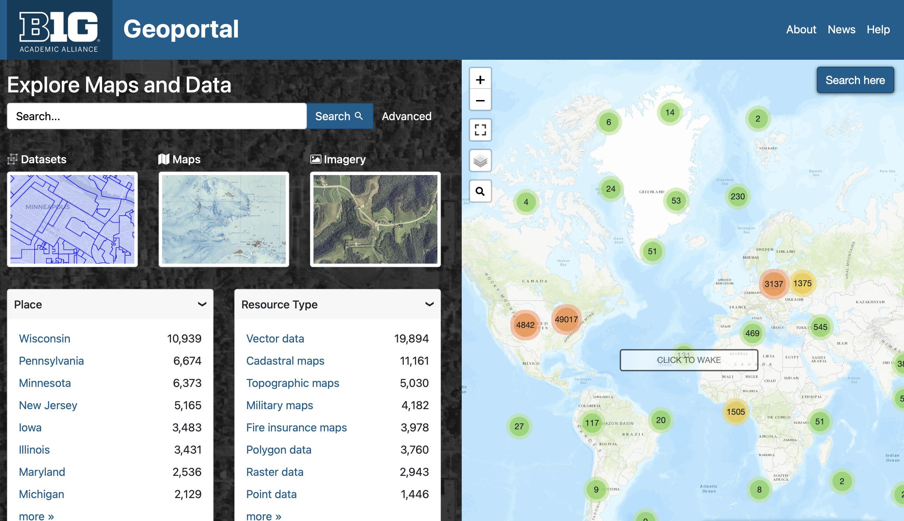

---
hide:
  - toc
  - navigation
---

# How to submit to the Showcase:

!!! info

	To add your instance of GeoBlacklight to the Showcase, you will need the following:
	
	* 	title
	* 	thumbnail image
	* 	description
	* 	site link
	*   code repository link, such as GitHub (optional)

## Option A: Ask a GeoBlacklight community member to edit this site

1. [Create a new issue on GitHub here.](https://github.com/geoblacklight/geoblacklight.github.io/issues)
1. Include the title, description and GeoBlacklight site link in the body of the issue
1. Upload an image to the issue that shows your homepage 
1. Include the label "showcase" 
1. Someone from the community will pick up the issue and add your instance to this site. It may be helpful to make a comment in Slack to make sure we are aware of the request.

## Option B: Update files and create a pull request in GitHub ("DIY" option)

1. Follow the instructions in the GitHub readme file on how to install mkdocs and clone this site to your desktop: [https://github.com/geoblacklight/geoblacklight.github.io](https://github.com/geoblacklight/geoblacklight.github.io).
1. Make a new branch.
1. Navigate to this folder: `docs/showcase/`.
1. Add your image to the showcase folder (jpg or png).
1. Open `docs/showcase/index.md`.
1. Create a new entry by copying and pasting the following template into the index.md file.

	!!! tip "Tips"
	
		- There is a copy button at the top right of the code block. 
		- Click on the text "example" to see an sample entry.
	
	
	=== "template"
	
	    ``` markdown
	    
	    -   
	
		#### [TITLE-OF-YOUR-SITE](LINK-TO-YOUR-SITE)
		
		DESCRIPTION
		  
		:octicons-link-external-16: https://LINK-TO-YOUR-SITE
		  
		:simple-github: https://github.com/LINK-TO-YOUR-CODE-REPO
		
		```
		
	=== "example"
		
		```markdown
		
		-   
	
		#### [Big Ten Academic Alliance Geoportal](https://geo.btaa.org)
		
		The Big Ten Academic Alliance Geoportal aggregates metadata from 14 institutions providing a single place to find and use aerial imagery, geospatial data, and scanned maps from multiple GIS data clearinghouses and library catalogs.
		  
		:octicons-link-external-16: https://geo.btaa.org
		  
		:simple-github: https://github.com/geobtaa/geoportal
		
		```
    
  1. Replace all of the placeholder text and values with your own. (The text you need to replace in the template is in ALL CAPS so that you can differentiate it. Don't use ALL CAPS for your own text.)
  1. Alphabetize your entry by title so that it appears on the Showcase page in a predicatable location.
  1. Preview your changes locally with the `mkdocs serve` command ([see the readme for instructions)](https://github.com/geoblacklight/geoblacklight.github.io/).
  1. Commit your changes to the GitHub branch.
  1. Publish your branch.
  1. Open a pull request to the Main branch.
  1. Someone from the community will review and/or merge your submission.